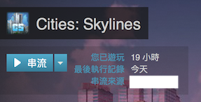

身為一個 Macbook Pro/Mac mini 使用者，有時候也會想玩遊戲。Steam 提供了 Steam Home Streaming 這個功能，讓你可以把區網內高階遊戲機的畫面，串流到其他低階的電腦上玩。但是如果不在同一個區網內，就沒有辦法了。

這時候想到的就是 OpenVPN ，只要網路頻寬足夠，不管在哪裡都可以用筆電串流家裡的高階電腦來玩遊戲。

這篇記錄作法，以免過一陣子忘記了

## 事前準備

* 用來實際跑遊戲的 Windows 機器一台
  * 安裝好 Steam
  * AnyDesk 遠端桌面軟體並設定好（也可用其他取代，但是 Microsoft Remote Desktop 不行，原因後述）
* OpenVPN Server
  * 我是用 ASUSwrt-Merlin 上的 OpenVPN
* 用來玩遊戲的 macOS 機器方面
  * 一樣安裝好 Steam
  * OpenVPN Client
    * 在 macOS 下就用 Tunnelblick 囉

## 設定

* 先來處理 OpenVPN server，
  * ASUSwrt-Merlin 上直接有 GUI 可以設定。要注意的是要用 TAP 而不能用 TUN
  * 設定好直接匯出設定檔，假設叫做 `client1.ovpn`

* 在 macOS 上的 Tunnelblick 把 `client1.ovpn` 匯入，然後連線

* 用 AnyDesk 連線到 Windows 機器，打開或是重新啟動 Steam
  * 不知道為什麼不重開一次伺服器端的 Steam，Client 會找不到它

* 關掉 AnyDesk

* 在 macOS 端執行 `sudo steam_forwarder.sh`
  * 請先編輯好檔案內的 `${SERVER}` 變數，設定 Steam server 的 IP address
  * 請先透過 homebrew 安裝 wireshark 和 socat

  ```
  brew install wirdshark socat
  ```

  * 這個檔案的用途在參考資料連結有說明

* 打開 macOS 端的 Steam，這時候應該就可以看到你的遊戲出現「串流」選項了

  


## 地雷

* OpenVPN 要用 TAP 不能用 TUN
* 不知道為什麼每次連線要重開串流 server 端的 Steam
* 要在串流 client 端執行 steam_forwarder.sh 把 UDP broadcast 封包轉為由 TAP device 發出去

## 參考資料

* https://lg.io/2015/04/12/run-your-own-high-end-cloud-gaming-service-on-ec2.html